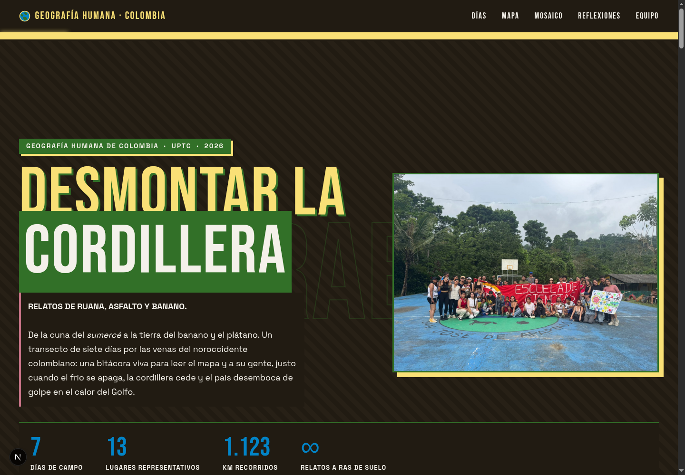
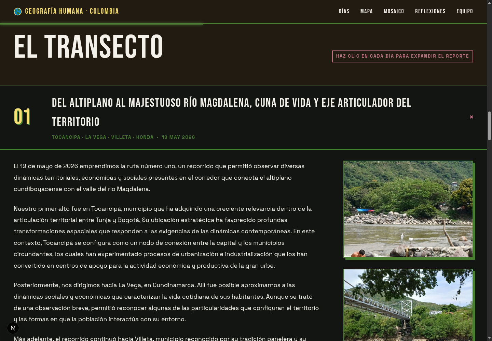
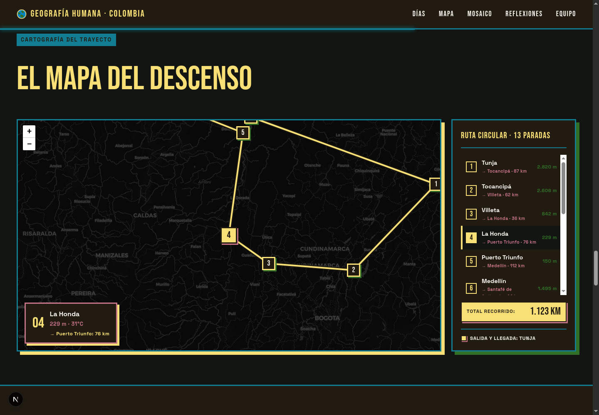
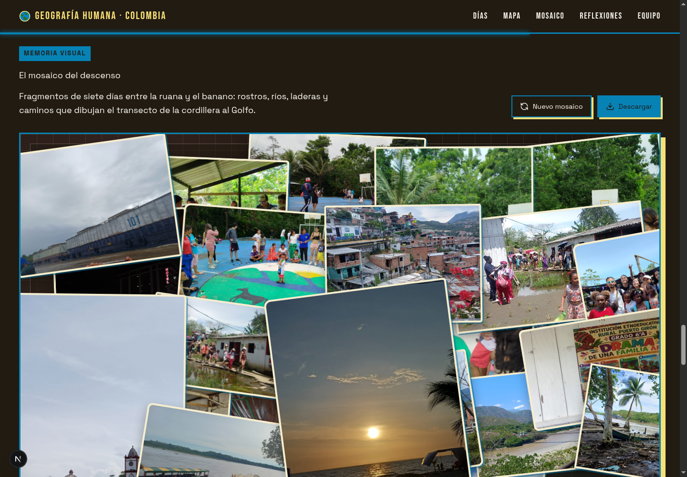
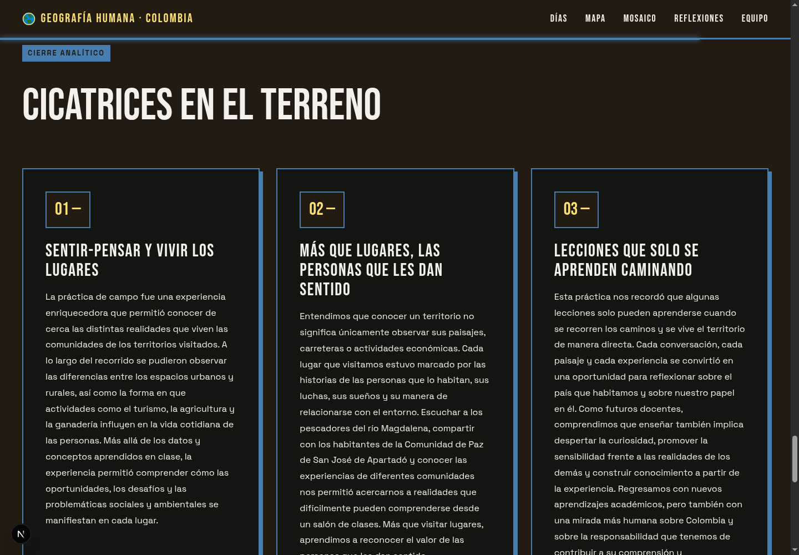

# Desmontar la Cordillera

Bitacora web interactiva de la salida pedagogica de Geografia Humana UPTC 2026. El proyecto narra un transecto de siete dias desde el altiplano cundiboyacense hasta el Golfo de Uraba, combinando relato academico, cartografia, fotografia, musica y componentes flotantes que acompanian el descenso por pisos termicos y territorios.



## Contenido

- [Descripcion](#descripcion)
- [Capturas](#capturas)
- [Caracteristicas](#caracteristicas)
- [Stack tecnico](#stack-tecnico)
- [Instalacion](#instalacion)
- [Scripts disponibles](#scripts-disponibles)
- [Estructura del proyecto](#estructura-del-proyecto)
- [Como editar el contenido](#como-editar-el-contenido)
- [Imagenes y multimedia](#imagenes-y-multimedia)
- [Despliegue](#despliegue)

## Descripcion

La aplicacion funciona como una cronica digital de campo. Su eje narrativo es el recorrido Tunja - Tocancipa - Honda - Occidente antioqueno - San Jose de Apartado - Turbo - Medellin - Guatape - Puerto Boyaca, con regreso simbolico al punto de partida.

El sitio no esta planteado como una landing page tradicional, sino como una experiencia de lectura: cada seccion abre una parte del viaje, muestra evidencias visuales, ubica lugares en el mapa y cierra con reflexiones sobre territorio, memoria, infraestructura, desigualdad, agua, ruralidad, ciudad y formas de habitar Colombia.

## Capturas

### Bitacora del transecto

La linea de tiempo permite abrir cada dia de campo, leer el reporte, ver etiquetas tematicas, fotografias y videos cuando estan disponibles.



### Mapa del descenso

El mapa usa Leaflet para mostrar una ruta circular con 13 paradas, altitud, temperatura y distancia aproximada entre tramos.



### Mosaico fotografico

El mosaico mezcla fotos del recorrido en una composicion animada con GSAP. Tambien permite regenerar el orden visual y descargar el resultado.



### Reflexiones y equipo

El cierre recoge aprendizajes de la practica y presenta a los expedicionarios.



## Caracteristicas

- Portada editorial con imagen hero, datos del recorrido y navegacion fija.
- Relato expandible por dias de campo.
- Linea de tiempo del transecto con paradas clave.
- Mapa interactivo con Leaflet, ruta, marcadores, altitud, temperatura y kilometraje.
- Mosaico fotografico animado con GSAP y exportacion a PNG mediante `html-to-image`.
- Modelo 3D embebido desde Sketchfab para introducir el cambio de paisaje cafetero.
- Radio flotante del bus con canciones servidas desde `public/musica`.
- Altimetro/termometro flotante que cambia segun el progreso de scroll.
- Metadatos SEO, Open Graph, Twitter card, sitemap, robots y JSON-LD.
- Componentes UI basados en Radix, shadcn/ui, Tailwind CSS y lucide-react.

## Stack tecnico

- Next.js 16 con App Router.
- React 19.
- TypeScript.
- Tailwind CSS 4.
- Radix UI y componentes shadcn.
- GSAP y ScrollTrigger para animaciones.
- Leaflet y React Leaflet para cartografia.
- html-to-image para exportar el mosaico.
- Vercel Analytics en produccion.
- pnpm como gestor de paquetes.

## Instalacion

Requisitos recomendados:

- Node.js 22 o superior.
- pnpm 11 o superior.

Instala dependencias:

```bash
pnpm install
```

Inicia el servidor de desarrollo:

```bash
pnpm dev
```

Abre el sitio en:

```text
http://localhost:3000
```

Si el puerto 3000 esta ocupado, Next.js usara otro puerto disponible y lo mostrara en consola.

## Scripts disponibles

```bash
pnpm dev
```

Ejecuta el generador del manifiesto del collage y levanta Next.js en modo desarrollo.

```bash
pnpm build
```

Genera el manifiesto del collage y compila la aplicacion para produccion.

```bash
pnpm start
```

Sirve la version compilada con `next start`.

```bash
pnpm lint
```

Ejecuta ESLint sobre el proyecto.

```bash
pnpm generate:collage
```

Lee las imagenes de `assets/images/collage`, las copia con nombres seguros a `public/assets/collage-generated` y actualiza `lib/collage-images.ts`.

## Estructura del proyecto

```text
app/
  layout.tsx              Metadatos, fuentes, SEO y layout global.
  page.tsx                Ensamble principal de la experiencia.
components/viaje/
  hero.tsx                Portada.
  intro.tsx               Presentacion academica de la salida.
  casa-cafetera.tsx       Iframe 3D de Sketchfab.
  transecto.tsx           Linea de tiempo y dias expandibles.
  mapa.tsx                Contenedor del mapa.
  mapa-leaflet.tsx        Implementacion de Leaflet.
  collage.tsx             Mosaico animado y descarga de imagen.
  reflexiones.tsx         Cierre analitico.
  equipo.tsx              Integrantes.
  altimetro.tsx           Panel flotante de altura y temperatura.
  radio-bus.tsx           Reproductor musical flotante.
lib/
  viaje-data.ts           Datos principales del viaje.
  musica.ts               Playlist de la radio del bus.
  collage-images.ts       Manifiesto generado para el mosaico.
assets/images/
  collage/                Fotos fuente para generar el collage.
  days/                   Imagenes originales de los dias.
  expedicionarios/        Fotos originales del equipo.
public/assets/
  Days/                   Imagenes servidas por la app.
  Expedicionarios/        Fotos servidas por la app.
  hero/                   Imagen principal de portada.
  collage-generated/      Salida generada para el collage.
public/musica/
  *.mp3                   Canciones de la radio del bus.
public/readme/
  *.png                   Capturas usadas por este README.
```

## Como editar el contenido

La mayor parte del contenido textual y geografico vive en `lib/viaje-data.ts`.

Para cambiar los textos del viaje:

1. Edita `introParrafos` para modificar la introduccion.
2. Edita `dias` para cambiar titulos, fechas, parrafos, etiquetas, fotos y videos por dia.
3. Edita `lugares` para ajustar coordenadas, altitud, temperatura y paradas del mapa.
4. Edita `reflexiones` para cambiar el cierre analitico.
5. Edita `equipo` para cambiar nombres, roles y fotografias de integrantes.

Las imagenes de cada dia se referencian con rutas publicas, por ejemplo:

```ts
{ src: "/assets/Days/image1.png", alt: "Día 1 - corredor del altiplano al rio Magdalena" }
```

Los videos cortos se integran con `videoId`, usando el identificador del video:

```ts
videoId: "nIXdz-TmZ4Y"
```

## Imagenes y multimedia

### Imagen hero

La portada usa:

```text
public/assets/hero/cordillera-hero.png
```

### Imagenes de dias

Las fotografias usadas en la bitacora estan en:

```text
public/assets/Days/
```

Si agregas nuevas imagenes, copialas a esa carpeta y referencia su ruta desde `lib/viaje-data.ts`.

### Fotos del equipo

Las fotos de expedicionarios estan en:

```text
public/assets/Expedicionarios/
```

### Collage

El flujo recomendado para nuevas fotos del mosaico es:

1. Copiar fotos fuente en `assets/images/collage/`.
2. Ejecutar:

```bash
pnpm generate:collage
```

3. Revisar que se actualicen `public/assets/collage-generated/` y `lib/collage-images.ts`.

### Musica

La radio del bus lee archivos `.mp3` desde:

```text
public/musica/
```

La lista de canciones se administra en `lib/musica.ts`:

```ts
export const PLAYLIST: string[] = [
  "cepeda.mp3",
  "amanecer.mp3",
  "vida.mp3"
]
```

## Capturas para el README

Las capturas actuales estan en:

```text
public/readme/
```

Archivos incluidos:

- `01-portada.png`
- `02-transecto.png`
- `03-mapa.png`
- `04-mosaico.png`
- `05-cierre-equipo.png`

Si en el futuro se actualiza el diseno, reemplaza esas imagenes manteniendo los mismos nombres para que el README no necesite cambios. Tambien puedes agregar nuevas capturas en la misma carpeta y referenciarlas con rutas relativas como:

```md

```

## Despliegue

El proyecto esta preparado para desplegarse en Vercel. Antes de publicar, ejecuta:

```bash
pnpm build
```

El build genera paginas estaticas para `/`, `/robots.txt`, `/sitemap.xml`, `/manifest.webmanifest` y el icono de la app.

## Desarrollo con v0

Este repositorio fue iniciado con v0 y conserva el enlace de continuidad del proyecto:

[Continuar trabajando en v0](https://v0.app/chat/projects/prj_j2GmWm3ojxRnsroLTVR9xdcGf0bZ)

## Creditos

- Proyecto academico: salida pedagogica UPTC de Geografia Humana 2026.
- Contenido base: `desmontando-la-cordillera.md`.
- Modelo 3D: Casa cafetera colombiana en Sketchfab, acreditado dentro de la app.
- Fotografias y relatos: expedicionarios del recorrido.
